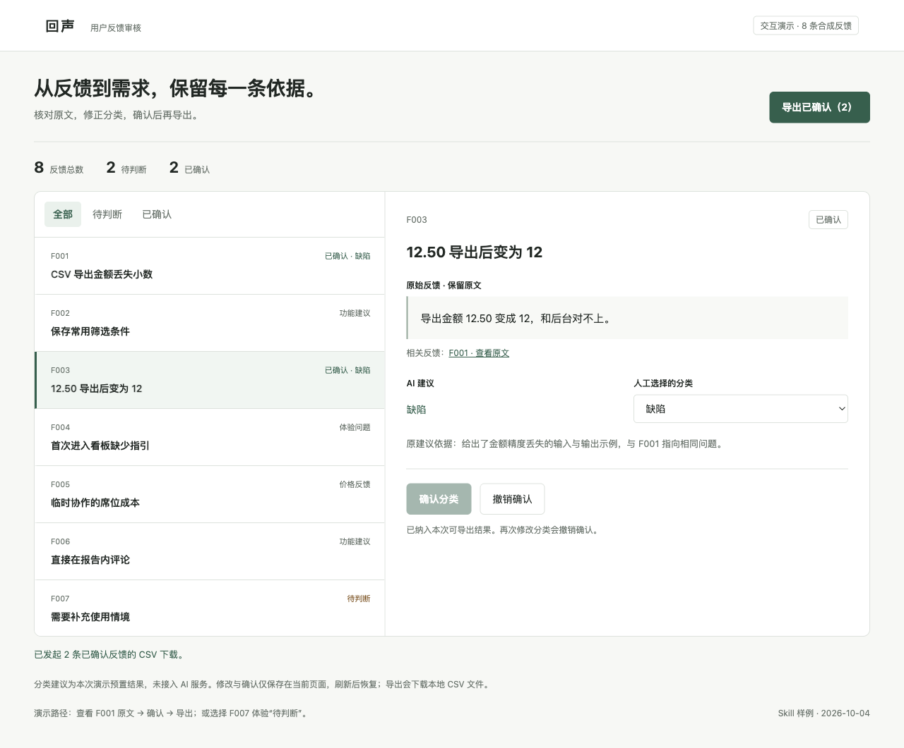
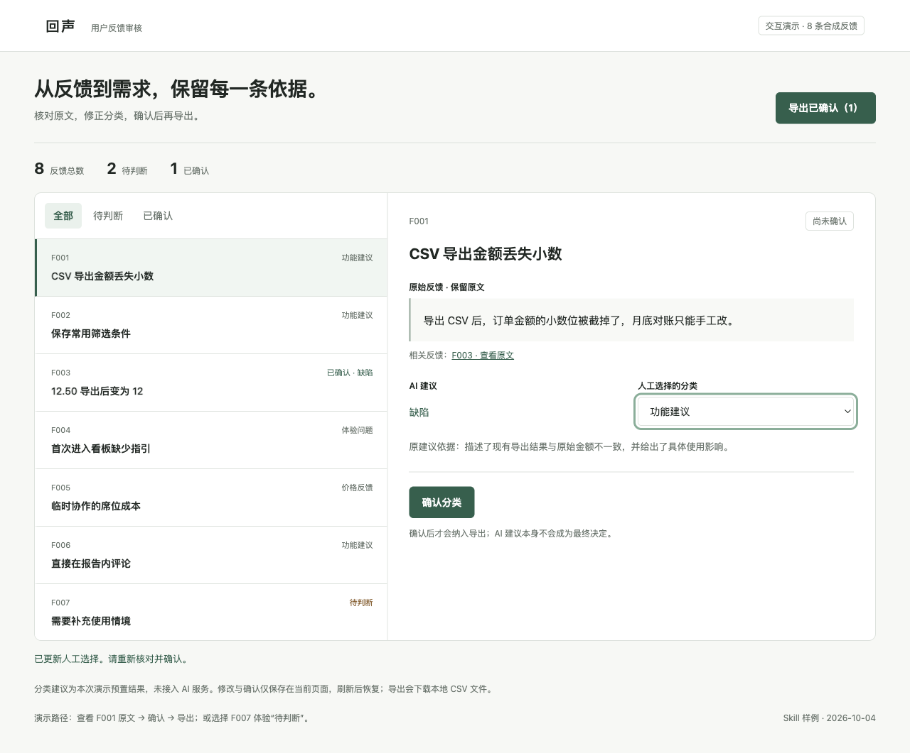
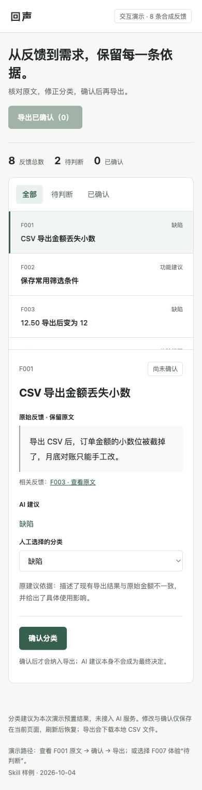

# 产品交互原型与验证

把需求和 PRD 做成可操作原型，覆盖关键任务、界面状态、恢复方式及目标视口。保留现有技术栈与视觉约束，实际检查交互，并区分演示功能、真实接口和生产实现。

面向 Codex，保留通用 Markdown 兼容性。一个任务入口，按需加载参考；可单独使用，也可与其他产品 Skill 衔接。

## 实际输出示例

**场景：回声 · 用户反馈审核与导出。** 本地 HTML 原型可查看原文、切换反馈、修改分类、确认与撤销，并下载 CSV。附确认两条后的界面、修改后状态和移动端截图，能直接检查规则如何呈现在界面上。



[阅读完整示例](examples/04-原型与实测.md) · [查看合成输入](examples/输入反馈.json) · [场景说明](examples/场景说明.md)

### 修改后与移动端

修改 F001 的分类后，它的确认状态撤销，只剩 F003 可导出。



<details>
<summary>查看 390 px 移动端截图</summary>



</details>

## 在 Codex 中使用

克隆到你的 Codex Skills 目录；如配置了 `CODEX_HOME`，下面的命令会使用该目录。已有同名目录时先检查已有版本。

```bash
git clone https://github.com/AI-Max2000/pm-prototyping.git "${CODEX_HOME:-$HOME/.codex}/skills/pm-prototyping"
```

安装后在新的 Codex 会话中调用：

```text
使用 $pm-prototyping，把“查看反馈原文 → 修改分类 → 人工确认或撤销 → 导出已确认项”做成可在本地打开的 HTML 原型。使用明确标记的演示数据，保留 AI 初始建议；待判断项不能直接确认，修改已确认分类会撤销确认。请检查键盘操作和移动端布局，实际走通“确认两条 → 导出两条 → 修改其中一条 → 再导出一条”，保存截图与检查记录。
```

在其他支持 Markdown 指令的工具中，读取 [SKILL.md](SKILL.md)，并按其中的链接加载需要的 `references/` 文件。网页研究、浏览器验证等操作以宿主实际可用工具为准。

## 仓库内容

- [SKILL.md](SKILL.md)：工作流程、边界与完成标准。
- [references/](references/)：按需使用的模板、方法和检查项。
- [agents/openai.yaml](agents/openai.yaml)：Codex 展示与调用元数据。
- [完整示例](examples/04-原型与实测.md)与 [assets/](assets/)：具体结果及实际截图。
- [运行记录](evidence/运行记录.json)：对应输入、截图和源文件哈希，便于核对。

- [可交互 HTML 原型](demo/prototype.html)：克隆后直接用浏览器打开；GitHub 文件页面只展示源代码。
- [浏览器检查记录](evidence/browser-checks.json) · [首次导出两条](evidence/export-two.csv) · [修改后导出一条](evidence/export-one.csv)。

## 已验证的范围

已在浏览器观察初始 8 条记录、2 条待判断、0 条确认，并实际验证键盘确认、待判断筛选，以及确认 F001/F003 后导出两条、改动 F001 后仅导出 F003；下载文件已回读。分类为预置建议，未接模型 API、批次导入或后台持久化；刷新恢复初始状态。未进行真实用户测试或生产验收。

演示日期：2026-10-04。展示图直接来自实际文档页面或原型浏览器截图，使用合成业务输入。Skill 结构已通过校验，未进行全局安装后的自动触发评测。

## 来源与许可

这是对相关工作方法的中文整合改写。具体来源文件、提交快照、采用内容与修改说明见 [SOURCES.md](SOURCES.md)。

本仓库新写内容采用 [Apache-2.0](LICENSE)；第三方原有许可和署名保留在 [licenses/](licenses/) 与 [NOTICE](NOTICE) 中。历史参考原包不在本仓库分发。

## 配套 Skill

- [产品提示词设计与评测](https://github.com/AI-Max2000/pm-prompt-design)
- [产品需求发现与交付拆解](https://github.com/AI-Max2000/pm-requirements)
- [产品需求文档与开发交接](https://github.com/AI-Max2000/pm-prd)
- [竞品与商业研究](https://github.com/AI-Max2000/pm-competitive-research)
- [产品指标与业务复盘](https://github.com/AI-Max2000/pm-metrics)
